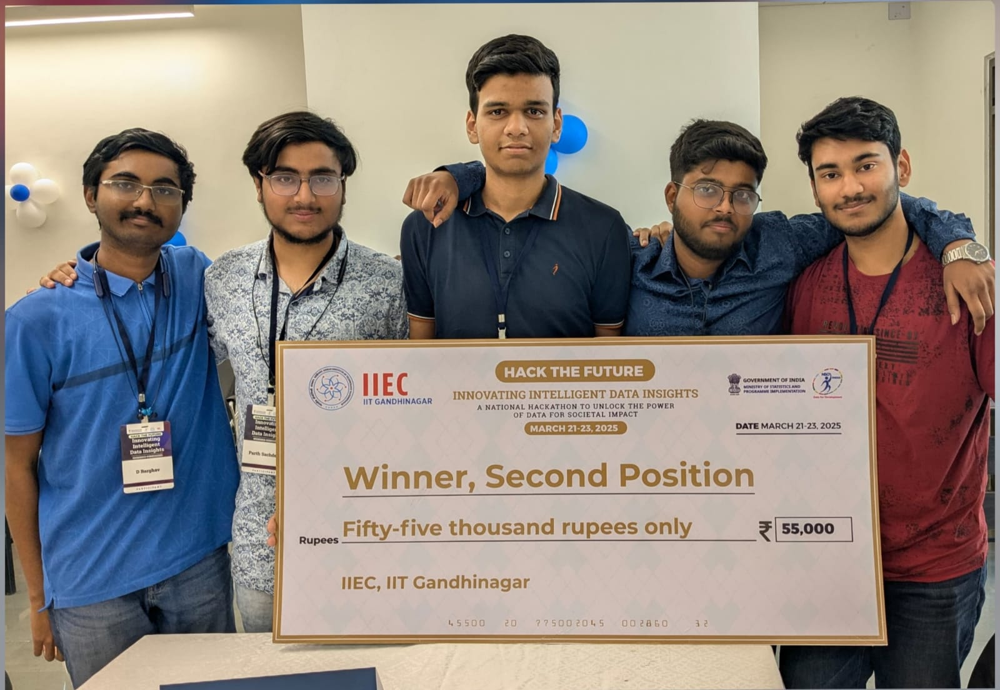

---

# 🧠 Nexus: Intelligent Expense Estimator

### 🏆 *Winner - Second Prize at Hack the Future 2025, IIT Gandhinagar*

An AI-powered system for accurate and instant estimation of **Monthly Per Capita Expenditure (MPCE)** and **Total Household Expense** using socio-economic survey data.

---

## 📌 Problem Statement

Given household and individual-level data from the **HCES (Household Consumer Expenditure Survey)** dataset, develop a solution to:

* Predict total household expenses and MPCE
* Provide regional analytics by state, district, and NSS region
* Enable intuitive natural language querying for expense-related insights

---

## 🚀 Our Solution

Team **Nexus** built a fully functional **Flask API** that:

* Delivers **sub-second** CPU-only predictions using stacked **XGBoost** models
* Uses **custom composite indices** generated from grouped binary possessions/purchases
* Differentiates **normal** vs **top-5% outlier** households using classification + separate regression pipelines
* Supports **natural language** queries through a chatbot powered by **Groq (LLaMA-3.2)**
* Provides **region-wise analysis** (state, district, NSS) for decision-making and policy insights

---

## 🔍 Key Features

* 📊 **MPCE & Total Expense Prediction** (R² = 0.70, MAPE ≈ 23%)
* 📈 **Top 10 Feature Contributions** included in report
* 🔍 **Household Lookup** by ID
* 🌐 **Regional Distribution Analysis** (State, District, NSS Region)
* 🤖 **Chatbot Interface** for non-technical users to ask natural-language questions
* ⚡ **CPU-Only Deployment** (no GPU dependency)
* 🐳 **Containerizable** with Docker for easy deployment

---

## 🛠️ Tech Stack

* **Python, Flask** (API Layer)
* **XGBoost, RandomForest, CatBoost** (Modeling)
* **Pandas, NumPy** (Data Processing)
* **Scikit-learn** (Preprocessing, Pipelines)
* **Groq API** (LLM Chatbot)
* **Jupyter Notebooks** (Exploratory Data Analysis & Regression)
* **Joblib, Pickle** (Model Serialization)

---

## 📁 Project Structure

```
├── app.py                       # Main Flask API
├── chat.py                      # Chatbot logic (LLM + RAG)
├── classification_train.py      # Classifier for top-5% households
├── regression_train.ipynb       # MPCE regression model training
├── feature_engineering_notebook.ipynb
├── feature_retrieval_arc.py     # Composite feature extraction models
├── data/                        # HCES dataset (HH + person-level)
├── model/                       # Pretrained XGBoost/Classifier models
├── Presentation.pptx            # Project overview slides
├── Nexus_Flowchart2.drawio.png  # Pipeline diagram
```

---

## 📦 Setup Instructions

```bash
# Clone the repo
git clone https://github.com/your-username/nexus-expense-estimator.git
cd nexus-expense-estimator

# Create virtual environment
python -m venv venv
source venv/bin/activate  # or venv\Scripts\activate on Windows

# Install dependencies
pip install -r requirements.txt

# Run the API
python app.py
```

---

## 🧪 API Endpoints

| Endpoint              | Description                           |
| --------------------- | ------------------------------------- |
| `/predict`            | Predicts MPCE and Total Expense       |
| `/search`             | Get household details by ID           |
| `/analyze_state`      | Analyze expense distribution by state |
| `/analyze_district`   | Analyze by district                   |
| `/analyze_nss_region` | Analyze by NSS region                 |
| `/chat`               | Ask natural language questions (Groq) |

---

## 🖥️ Using the Web UI for Predictions

You can interact with our project via a **user-friendly frontend interface** that sends data to the Flask backend and returns MPCE & Total Expense predictions.

### 🔧 Steps to Use the UI

1. **Start the Flask Backend**

Make sure the Flask server is running:

```bash
python app.py
```

It will start at: `http://127.0.0.1:5500`

2. **Open the Web UI**

Navigate to the frontend folder (if included in the repo) or open the `index.html` file in your browser.

> *Note: If you're using a separate frontend (e.g., React, HTML, or Streamlit), ensure it makes POST requests to the `/predict` endpoint on port 5500.*

3. **Fill in the Required Details**

* Select **State**, **District**, **Household Type**
* Add **Household Possessions** (like mobile, TV, vehicle)
* Enter **Head of Household** details (age, gender, education)
* Add **Persons in Household** with age, relation, education, etc.

4. **Click “Predict”**

Hit the **Predict** button.
The model will return:

* ✅ **Monthly Per Capita Expenditure (MPCE)**
* 💰 **Total Household Expense**

---

### 📦 Sample API Payload (used by UI)

Here’s an example of what the UI sends to the backend (`/predict`):

```json
{
  "State": "Gujarat",
  "District": 24,
  "Sector": "Urban",
  "Household Size": 4,
  "Household Type": 2,
  "Mobile Handset": 1,
  "Clothing": 1,
  ...
  "entry": [
    {
      "relation": 1,
      "gender": 1,
      "age": 45,
      "education_level": 4,
      "education_years": 10,
      "internet": 1,
      "marital": 2,
      "meals_home": 60,
      ...
    },
    ...
  ]
}
```
---

## 🏅 Awards & Achievements

🏆 **Second Prize Winner** – [Hack the Future 2025](https://iieciitgn.com/hackthefuture/), IIT Gandhinagar
🗓️ *March 21–23, 2025*
👨‍💻 **Team Nexus**:

* Sayuj Gupta (CSE) – Team Leader, Feature Engineering and Model Testing
* Himanshu (CSE) – Web Development and Feature Engineering
* D Barghav (Mech) – Dataset Preparation and Model Training
* Purushartha Gupta (Civil) – Feature Engineering and Model Training
* Parth Sachdeva (CSE) – Feature Engineering and Model Training



---

## 📈 Future Scope

* 🗂️ Add multilingual support for chatbot queries
* 🧠 Integrate deeper NLP capabilities for trend explanations
* 🛰️ Expand data coverage with satellite-derived poverty metrics
* 📱 Mobile-friendly frontend for rural outreach

---
